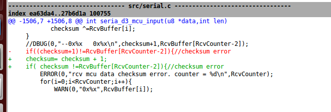

---

---

2021-0515：

字符串删掉某个字符:

c语言删除某个字符串中的某一个字符_Janik的博客-CSDN博客 - https://blog.csdn.net/qq_39769995/article/details/83211154

```c
void delete_char(char str[],char target){
	int i,j;
	for(i=j=0;str[i]!='\0';i++){
		if(str[i]!=target){
			str[j++]=str[i];
		}
	}
	str[j]='\0';
}
```


如何在引号里面引用宏_水晶鞋-CSDN博客_sas引号里调用宏变量 - https://blog.csdn.net/mos2046/article/details/25741223

```
#define SKYBELL_FWVER	8850
#define __SYKBELL_VERSION(ver) "SKYBELL_APP_VER:"#ver""
#define SYKBELL_VERSION(ver)  __SYKBELL_VERSION(ver)
const char* SKYBELL_FWVER_STR=SYKBELL_VERSION(SKYBELL_FWVER);
```


判断一个unsigned char 相加是否溢出 的好思想:

```C
 while(i != 0xEC00){
    
        if(i%2 == 0){
            savel = l;    
            l = (l+a[i]);
        }
        else{
            if(savel > l){
                h = (h+a[i])+1;
            }
            else{
                h = (h+a[i]);
            }
        }
        i++;
    }
```

---

临时变量，类型转换的bug:



---

常见一些变量名前缀加上psz什么意思?比如char*pszBuffer,这是什么意思？_百度知道 - https://zhidao.baidu.com/question/503195581.html


(1条消息) strcasecmp函数_闫钰晨的博客-CSDN博客_strcasecmp函数 - https://blog.csdn.net/yyc794990923/article/details/76268076

---

strdup


Linux 常用C函数（中文版） - http://net.pku.edu.cn/~yhf/linux_c/


[From My Companion]memmem_weixin_34008933的博客-CSDN博客 - https://blog.csdn.net/weixin_34008933/article/details/90684451